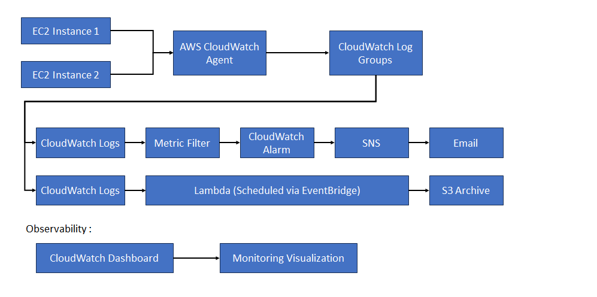
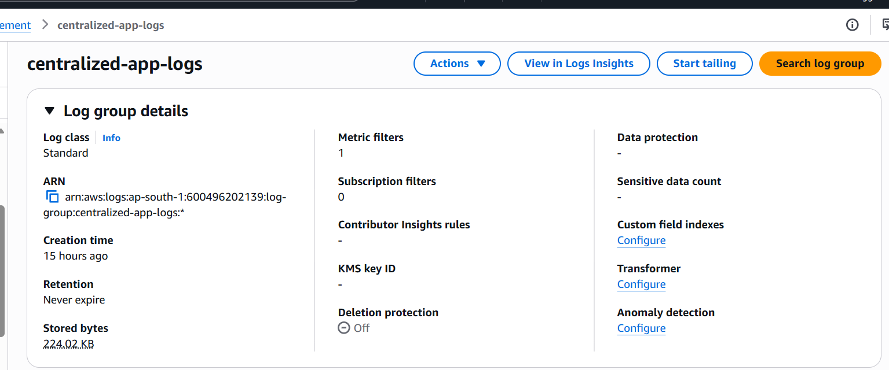
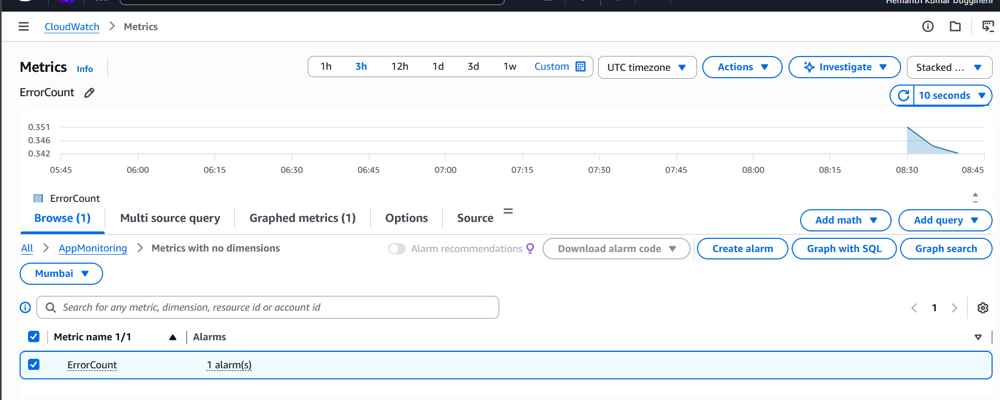
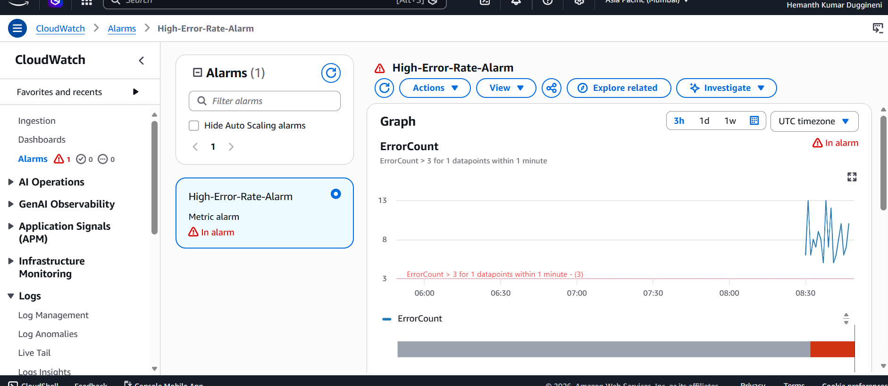
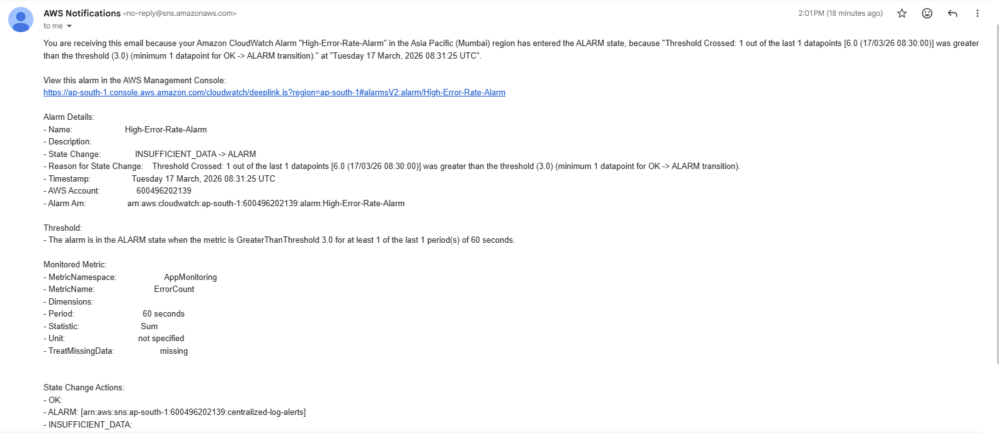
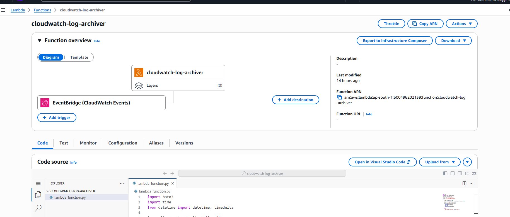
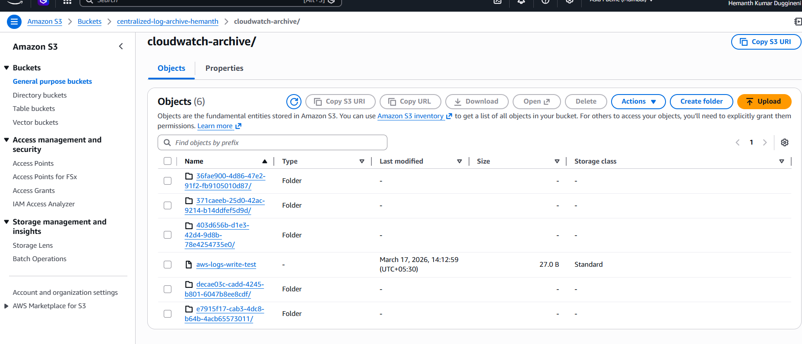
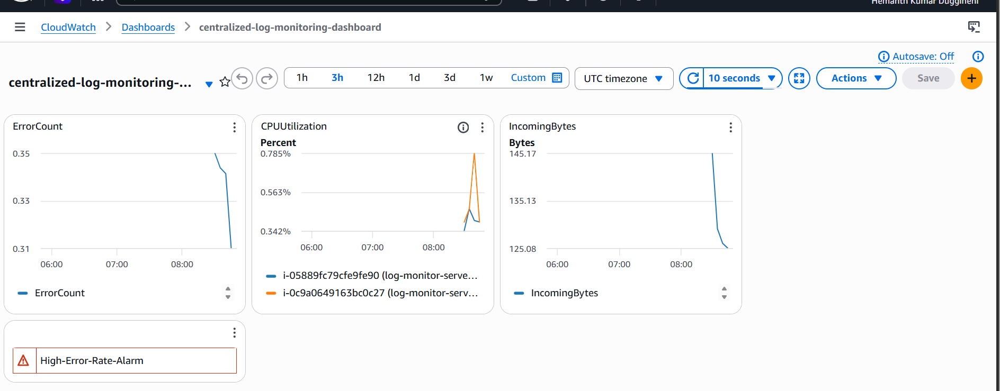

# Centralized Log Monitoring & Alerting System on AWS

## 📌 Project Overview

Applications running across multiple EC2 instances generate logs independently, making it difficult to detect issues proactively. This project implements a centralized log monitoring system using AWS CloudWatch, enabling automated alerting and long-term log archival for cost optimization.

This solution simulates a real-world production monitoring pipeline used by DevOps and SRE teams.

---

## 🎯 Problem Statement

In distributed environments:

- Logs are stored locally on servers
- Failures are detected only after user complaints
- No centralized visibility into system errors
- Long-term log storage becomes costly

---

## ✅ Solution

Designed and implemented a centralized logging architecture that:

- Aggregates logs from multiple EC2 instances into CloudWatch
- Detects error patterns using Metric Filters
- Triggers automated alerts via SNS
- Archives logs to Amazon S3 using scheduled AWS Lambda
- Provides operational visibility through CloudWatch Dashboard

---

## 🏗️ Architecture

---

## ⚙️ Tech Stack

- AWS EC2
- CloudWatch Logs
- CloudWatch Metric Filters & Alarms
- AWS SNS
- AWS Lambda
- Amazon EventBridge
- Amazon S3
- Python (Flask logging app)
- CloudWatch Agent

---

## 🚀 Implementation Steps

### 1. Application Layer
- Deployed Python Flask logging application on two EC2 instances
- Configured systemd service for background execution

### 2. Log Centralization
- Installed and configured CloudWatch Agent
- Aggregated application logs into centralized log group

### 3. Log-based Monitoring
- Created Metric Filter to detect ERROR logs
- Configured CloudWatch Alarm for error threshold breach

### 4. Alerting System
- Integrated CloudWatch Alarm with SNS
- Configured email notifications for incident detection

### 5. Log Archival Automation
- Implemented Lambda function to export logs daily
- Scheduled automation using EventBridge
- Archived logs to S3 for long-term retention

### 6. Monitoring Dashboard
- Built CloudWatch Dashboard for:
  - Error rate monitoring
  - EC2 CPU utilization
  - Alarm status visualization
  - Log ingestion metrics

---

## 📸 Project Screenshots

### EC2 Instances

### Centralized Logs

### Error Metric

### Alarm Trigger

### SNS Alert

### Lambda Automation

### Log Archive in S3

### Monitoring Dashboard

---

## 🎯 Key Learnings

- Centralized logging architecture design
- Log-based monitoring using CloudWatch
- Automated alerting pipeline implementation
- Event-driven automation using Lambda & EventBridge
- Cost optimization strategies for log storage
- Observability principles in distributed systems

---

## 🔮 Future Improvements

- Integrate with OpenSearch for advanced log analytics
- Implement structured logging
- Add Slack / PagerDuty alert integration
- Use Infrastructure as Code (Terraform)
- Add auto-remediation workflows

---

## 👨‍💻 Author

Hemanth Kumar